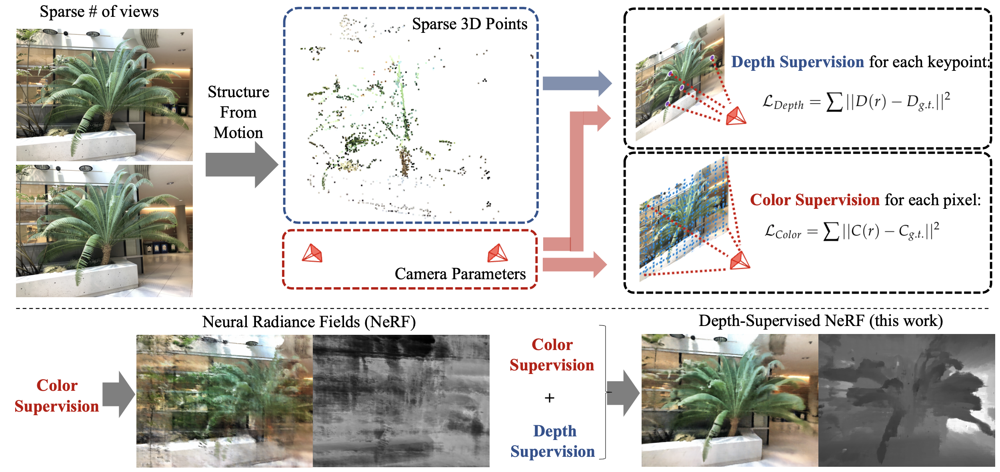

# Depth-supervised NeRF: Fewer Views and Faster Training for Free

[**Project**](https://www.cs.cmu.edu/~dsnerf/) | [**Paper**](https://arxiv.org/abs/2107.02791) | [**YouTube**](https://youtu.be/84LFxCo7ogk)

Pytorch implementation of DS-NeRF. DS-NeRF can improve the training of neural radiance fields by leveraging depth supervision derived from 3D point clouds. It can be used to train NeRF models given only very few input views.

<p align="center">
  
</p>


[Depth-supervised NeRF: Fewer Views and Faster Training for Free](https://www.cs.cmu.edu/~dsnerf/)

arXiv 2107.02791, 2021

 [Kangle Deng](https://dunbar12138.github.io/)<sup>1</sup>,
 [Andrew Liu](https://andrewhliu.github.io/)<sup>2</sup>,
 [Jun-Yan Zhu](https://www.cs.cmu.edu/~junyanz/)<sup>1</sup>,
 [Deva Ramanan](https://www.cs.cmu.edu/~deva/)<sup>1,3</sup>,

<sup>1</sup>CMU, <sup>2</sup>Google, <sup>3</sup>Argo AI

---

We propose DS-NeRF (Depth-supervised Neural Radiance Fields), a model for learning neural radiance fields that takes advantage of depth supervised by 3D point clouds. Current NeRF methods require many images with known camera parameters -- typically produced by running structure-from-motion (SFM) to estimate poses and a sparse 3D point cloud. Most, if not all, NeRF pipelines make use of the former but ignore the latter. Our key insight is that such sparse 3D input can be used as an additional free signal during training.

<p align="center">
  
</p>

## Results

NeRF trained with 2 views:
<p align="center">
  
</p>

DS-NeRF trained with 2 views:
<p align="center">
  
</p>

NeRF trained with 5 views:
<p align="center">
  
</p>

DS-NeRF trained with 5 views:
<p align="center">
  
</p>

---


## HƯỚNG DẪN CÀI ĐẶT

Tạo môi trường ảo cho project:
```
python3 -m venv venv
```
Kết nối với môi trường ảo:

Windows:
```
venv\Scripts\activate
```

Linux:
```
source venv/bin/activate

```
### Dependencies

Install requirements:
```
pip install -r requirements.txt
```
Nếu trong quá trình chạy project gặp phải lỗi không nhận cuda. Bạn có thể thực hiện uninstall phiên bản torch hiện tại với command:
```
pip uninstall torch
```
và thực hiện tải xuống phiên bản torch phù hợp trên website Pytorch [tại đây](ttps://pytorch.org/).

Nếu bạn muốn tính toán với data của riêng bạn thì cần tải [COLMAP](https://github.com/colmap/colmap)

### Data

Download data ví dụ mẫu: `fern_2v`
```
bash download_example_data.sh
```
Nếu câu lệnh trên gặp lỗi, có thể thực hiện tải data trực tiếp tại [đây](http://cs.cmu.edu/~dsnerf/fern_2v.zip) sau đó giải nén file.

Nếu muốn thử nghiệm với những data khác được nêu trong bài báo, có thể download tại [đây](https://drive.google.com/drive/folders/14boI-o5hGO9srnWaaogTU5_ji7wkX2S7).

### Pre-trained Models
Bạn có thể download pre-trained model cho dữ liệu `fern_2v` tại [đây](https://drive.google.com/drive/folders/1lby-G4163NFi7Ue4rdB9D0cM67d7oskr?usp=sharing).

Tạo một đường dẫn folder `./logs` cho pre-trained model như minh họa đưới đây để có thể thử nghiệm:
```
├── logs 
│   ├── fern_2v    # downloaded logs
│   ├── flower_2v  # downloaded logs
```

### Chạy chương trình

#### khởi tạo camera poses và sparse depth cho dữ liệu với COLMAP (có thể đọc kĩ hơn trong documentation của COLMAP) (tùy chọn)

Bước này chỉ cần thực hiện nếu bạn muốn sử dụng data riêng của mình.

Đối với data `fern_2v` đã được giải nén, bạn cần tạo đường dẫn folder cho data như minh họa dưới đây:
```
├── data
│   ├── fern_2v
│   ├── ├── images
│   ├── ├── ├── image001.png
│   ├── ├── ├── image002.png
```


#### Testing

Kiểm tra lại đường dẫn đến data trong file `fern_dsnerf.txt` ở folder `config` tại mục `datadir` sao cho đúng tên folder chứa data.

Khi đã có folder của model (có thể là bạn tự train hoặc download ở trên) ở folder `.\logs`: 

- Thực hiện câu lệnh sau để render video:
```
python run_nerf.py --config configs/fern_dsnerf.txt --render_only
```

Sau khi được render, video sẽ được lưu lại trong thư mục của thí nghiệm tại folder `logs`.

<!-- - to only compute the evaluation metrics:
```
python run_nerf.py --config configs/fern_dsnerf.txt --eval
``` -->


#### Training

Để train DS-NeRF trên tập dữ liệu `fern` thực hiện câu lệnh sau (tùy chỉnh theo tên file config của bạn):
```
python run_nerf.py --config configs/fern_dsnerf.txt
```

Sau khi thực hiện, chương trình sẽ tạo ra folder thí nghiệm theo đường dẫn `./logs`, chứa các checkpoint và video được render.

Bạn có thể tự tùy chỉnh config cho thí nghiệm của mình để thực hiện trên các datasets khác.

---

## Citation

If you find this repository useful for your research, please cite the following work.
```
@article{kangle2021dsnerf,
  title={Depth-supervised NeRF: Fewer Views and Faster Training for Free},
  author={Deng, Kangle and Liu, Andrew and Zhu, Jun-Yan and Ramanan, Deva},
  journal={arXiv preprint arXiv:2107.02791},
  year={2021}
}
```

---

## Acknowledgments

This code borrows heavily from [nerf-pytorch](https://github.com/yenchenlin/nerf-pytorch). We thank Takuya Narihira, Akio Hayakawa, Sheng-Yu Wang, and for helpful discussion. We are grateful for the support from Sony Corporation, Singapore DSTA, and the CMU Argo AI Center for Autonomous Vehicle Research.
